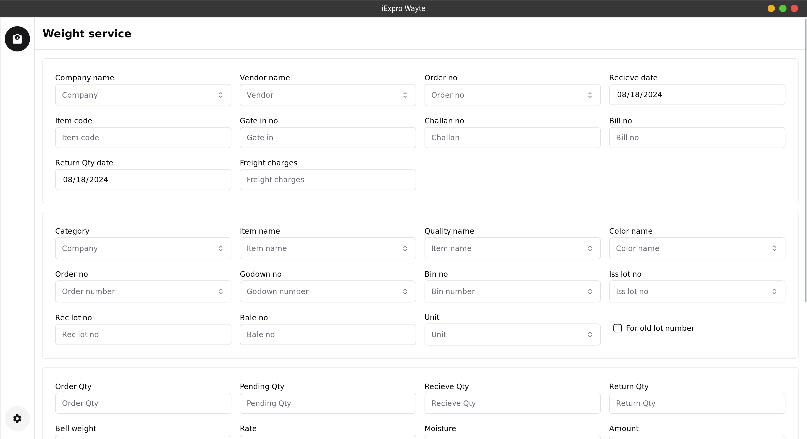
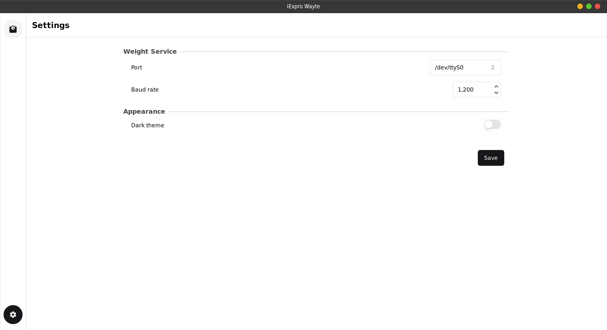

# iExpro Wayte




## Dependencies

- [Rust](https://www.rust-lang.org/)
  - [Tauri](https://tauri.app/) (windowing and backend)
- [Typescript](https://www.typescriptlang.org/) (Frontend)
- [Solidjs](https://www.solidjs.com/) (Frontend framework)
- [Tailwindcss](https://tailwindcss.com/) (Styling)
- [Vite](https://vitejs.dev/) (Bundler)
- [Zustand](https://github.com/pmndrs/zustand) (State management)
- [Biome](https://biomejs.dev/) (Linter, formatter)
- [pnpm](https://pnpm.io/) (Package manager)

## Why rust and tauri?

Tauri and Rust were used for the application due to their combined strengths in building high-performance, secure, and cross-platform desktop applications. We can build our application for Windows, Mac and Linux

Tauri lets developers use web technoglogies to build frontend, which is extremely helpful since we can create beautiful and accessible designs and iterative over changes extremely fast.

Tauri lets developers use Rust to perform native functionality in an easy, safe and performant way.

### Inter process communication

The application has two processes running

- The Solidjs frontend
- The Rust backend

Both processes communicate with each other using two different ways

1. [Commands](https://tauri.app/v1/guides/features/command)
2. [Events](https://tauri.app/v1/guides/features/events/)

The application uses a combination of both of the them to communicate with serial ports.

### Weight reader

Whenever the `/protected/weight-service/` route is opened in the application. The frontend invokes a command in the backend (`emit_weight_on_port`) with the port and baud rate saved in the application settings store. The backend tries to open a connection with that port and baud rate

if it fails, it returns with the error back to the frontend.

if it succeeds,

- Creates a var `run` of type `Arc<Mutex<boolean>>` in the function scope.
- Creates a event listener (`weight-close`) which will set the above `run` var to false when invoked.
- Also spawns a thread which reads data from the serial port and emit a event (`weight-read`) with the weight data with a delay of `300ms` as long as `run` var is true.
- Returns unit.

Then on the frontend we create a event listener which listens for `weight-read` events and updates the `bell_weight` field.

## Build instructions

Make sure you have the following installed

- [Rust](https://www.rust-lang.org/) (with cargo)
- [pnpm](https://pnpm.io/)

In root directory first install the dependencies

```sh
pnpm install
```

then

to open the tauri application.

```sh
pnpm tauri dev
```

or to open only the web application

```sh
pnpm dev
```

or to build for production

```sh
pnpm tauri build
```
